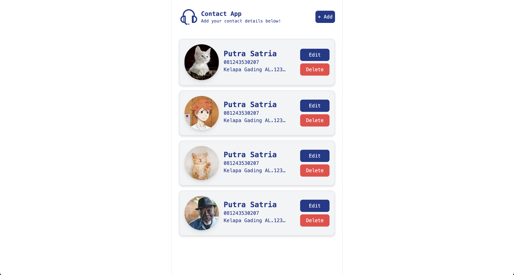

# Contact Hub

Contact Hub is a simple contact management application designed to help users organize their contacts efficiently. And this project was created as a re-learning about DOM

## Features

- [ ] **Add Contacts**: Easily add new contacts to your list.
- [ ] **Edit Contacts**: Update contact details as needed.
- [ ] **Delete Contacts**: Remove unnecessary contacts from your list.

## Technologies Used

- HTML
- CSS / Tailwind CSS
- JavaScript
